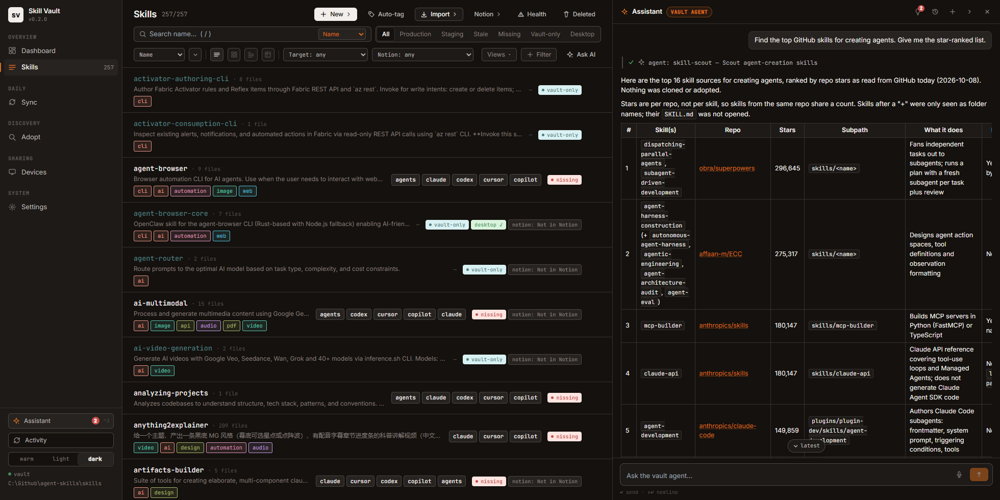
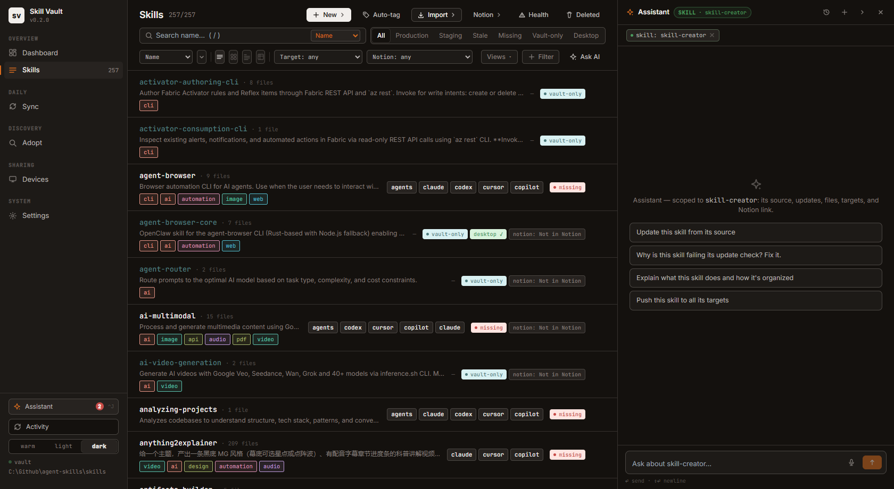
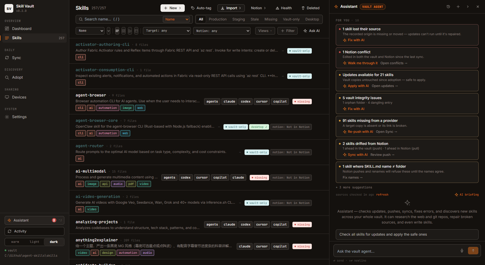
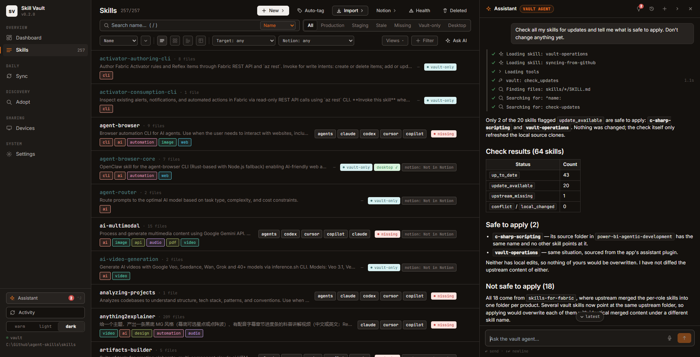

# AI Assistant

The Skill Vault App has a built-in AI assistant: a docked chat pane available on
every page that can research, explain, and **fix** vault problems — repair broken
update sources, apply updates, push and pull skills, drive Notion sync, and
diagnose failed operations. It runs on your local [Claude Code](https://claude.com/claude-code)
CLI, so it uses your existing Claude subscription and nothing leaves your machine
except the model calls Claude Code itself makes.

- [Requirements](#requirements)
- [Opening the assistant](#opening-the-assistant)
- [Using it: what to ask](#using-it-what-to-ask)
- [The agent, its skills, and its specialists](#the-agent-its-skills-and-its-specialists)
- [Proactive suggestions — "For you"](#proactive-suggestions--for-you)
- [Voice input](#voice-input)
- [Ask AI entry points](#ask-ai-entry-points)
- [Chats, sessions, and cost](#chats-sessions-and-cost)
- [What it can and cannot do](#what-it-can-and-cannot-do)
- [Install the assistant's skills into your vault](#install-the-assistants-skills-into-your-vault)
- [How it works](#how-it-works)

## Requirements

The [Claude Code](https://claude.com/claude-code) CLI (`claude`) must be installed
and signed in on the machine running the app. The panel checks availability and
shows the reason when it can't run (CLI missing, vault not configured). Chat turns
bill to your Claude subscription; each reply shows its cost. Expect roughly
$0.05–0.20 for a plain answer or a single check, and $1–1.50 for a
research-heavy turn that delegates to a specialist (a GitHub discovery sweep, a
multi-skill repair).

## Opening the assistant

Three ways in:

- the **Assistant** button at the bottom of the sidebar (shows a red count when
  suggestions need attention, and a pulsing dot while a turn is running),
- **Ctrl/⌘ + J** from anywhere,
- any **✦ Ask AI** button (see [entry points](#ask-ai-entry-points)).

The pane is docked, not a modal — the rest of the app stays fully usable beside
it. Drag its left edge to resize, collapse it to a slim rail, or close it; a
running turn keeps working either way.

## Using it: what to ask

Type (or dictate) a request in plain language. The assistant reads the page you
are on, any skill you opened it from, and recent failures, so you rarely need to
spell out context. Things it handles well:

| You want to… | Ask something like | What happens |
|---|---|---|
| Know what needs attention | *"What needs attention?"* or click **✦ AI briefing** | A prioritized plan built from the suggestion cards. Nothing is changed. |
| Update everything safely | *"Check all skills for updates and apply the safe ones"* | One bulk check, safe updates applied, conflicts listed for you to decide. |
| Fix a broken source | *"This skill says gone upstream. Fix it."* | It traces where the source moved (git history, then the web), repairs the origin, and applies the update. |
| Find new skills | *"Find top-starred GitHub skills for building MCP servers"* | A verified, star-ranked table with the ones you already have marked, then an offer to adopt. |
| Diagnose failures | *"Why did my last sync fail?"* | Failures are clustered into root causes, each with the exact fix. |
| Sync with Notion | *"What's the Notion sync state?"* / *"Push these to Notion"* | Status and a plan first; conflicts are sent to the Conflicts page. |
| Write or improve a skill | *"Create a skill for reviewing SQL migrations"* | It writes the folder, registers it in the vault, and reviews it against a checklist. |
| Find your way around | *"Where do I fix name mismatches?"* | The page, the path, and the steps, plus an offer to do it when it can. |

When a decision is yours to make (which side wins a conflict, whether to clear a
dead source), the assistant stops and gives you numbered options instead of
picking for you. Reply with the number.

Starting from a skill scopes the chat to that skill. Open **✦ Ask AI** on any
skill and the header chip changes to `SKILL · <name>`, with prompts for that
skill ready to click:

## The agent, its skills, and its specialists

Every chat is led by one comprehensive agent — **vault-assistant** — which
reads your context, loads the right skill for the job, and delegates heavy
research or parallel work to specialists. The header chip shows the chat's
*scope*:

| Chip | When | Scope |
|---|---|---|
| `VAULT AGENT` | Opened generally (sidebar, Ctrl+J, bulk/filter context) | The whole vault: bulk update checks, push/sync, cross-skill error fixing, discovery |
| `SKILL · <name>` | Opened from a skill (side panel, detail view, a failure row) | That one skill: its source, updates, files, targets, Notion link |

**Ten bundled skills** carry the know-how, loaded on demand (you'll see
`Loading skill: …` lines in the timeline):

| Skill | Covers |
|---|---|
| vault-operations | Every vault tool recipe + a full tool I/O reference |
| vault-format | Manifest, origins, hashes, update-status semantics |
| syncing-from-github | Adopt → check → apply → repair pipeline, bulk passes |
| finding-skill-origins | Git forensics + web search for moved/renamed sources |
| connecting-notion | Link states, push/pull plans, drift, failure modes |
| triaging-errors | Clustering failures, per-kind probes, exact fixes |
| analyzing-suggestions | Reading "For you" cards; powers the AI briefing |
| navigating-app-features | Every page, button, deep link, and sv CLI equivalent |
| authoring-skills | Writing and improving skills to a quality checklist |
| discovering-skills | GitHub star-ranked skill search → one-step adoption |

**Five specialist subagents** handle work that would flood the chat or can
run in parallel — they load the same skills and report back: **repo-hunter**
(provenance research), **update-fixer** (one broken source each; several run
in parallel on bulk passes), **skill-scout** (GitHub discovery sweeps),
**error-triager** (read-only failure sweeps — it literally cannot mutate),
**notion-doctor** (verbose Notion diagnosis). You'll see handoffs in the
timeline as a line such as `agent: repo-hunter — Hunt check-updates upstream`. Simple asks are never delegated, so they
stay seconds-fast; expect roughly 3–5s for a plain answer, ~30s with a tool
check, ~1 minute for research, and 1–2 minutes for a bulk pass with parallel
repairs.

Context travels as removable **chips** under the header: the focused skill, a
multi-selection from the Skills page, active filters, a failure being
discussed. Chips (and the agent) freeze once the first message is sent — start
a **New chat** to change scope.

## Proactive suggestions — "For you"

You don't have to ask what's wrong. When the panel opens on a new chat, a
**For you** section lists ranked suggestion cards built from the app's own
signals — no AI cost, computed instantly:

- broken update sources (*gone upstream*), available updates, update conflicts
- recently failed operations (push/pull/adopt/update/Notion)
- Notion conflicts, drift, vanished pages, legacy pages
- stale or missing provider copies, vault integrity issues, name mismatches
- origin-less skills, outdated Claude Desktop packages, lingering staging,
  untagged skills

Each card offers **✦ Fix with AI** (opens the chat pre-filled with the exact
context and task — you review before sending) and/or a deep link to the right
page. Severity drives order (red = act, amber = worth a look, grey = housekeeping,
collapsed behind "+ N more"). Dismiss a card with × — it stays gone for 7 days
or until its content changes (a new broken skill revives it).

The expensive signal — checking every skill's source — runs as a **background
sweep**: ~45 seconds after the app starts and every 6 hours after, pulling your
local clones the same way a manual *Check updates* does, then caching statuses
(the cache survives restarts). The footer shows freshness (`sources checked 2h
ago · refresh`); the sweep is strictly read-only and never changes the vault.

Once a conversation is active, the same cards live behind the **💡 lightbulb**
button in the panel header, and the sidebar Assistant button carries a count of
action-tier cards. The **✦ AI briefing** button (one click, one turn) has the
assistant prioritize everything into a plan — it never runs automatically.

## Voice input

The composer has a **🎤 mic button** (Chrome/Edge — it uses the browser's
built-in speech recognition and hides itself where unsupported). Click to
dictate: finished phrases append to the draft, the in-flight guess shows as a
live hint, and the button pulses while listening. Dictation stops when you
send, toggle the mic, or close the panel. The first use asks for microphone
permission.

## Ask AI entry points

**✦ Ask AI** buttons open the chat pre-loaded with context (the prompt is
pre-filled, never auto-sent):

- **Check for updates dialog** — failing rows (*gone upstream*, *source
  missing*, *error*, conflicts) get **Ask AI to fix**
- **Sync page** — failed rows, and the failure toast's **Ask AI** action
- **Skill side panel and detail view** — opens the per-skill agent (the detail
  popup closes itself so the chat is visible)
- **Notion push/pull review and Conflicts pages**
- **Skills page** — the toolbar button carries your active filters; the
  multi-select bar's button carries the selected skills

## Chats, sessions, and cost

Replies stream in live, with a compact **tool timeline** showing what the agent
is doing (`Searching web: …`, `Running: git log…`, `vault: set_origin`,
`agent: repo-hunter`) — click a line for its input/output. **Stop** kills the
turn immediately. Each reply ends with its cost and duration.

A table too wide for the pane scrolls sideways inside the reply.

The history button lists recent chats; conversations survive app restarts and
resume with full context. Multiple chats can exist; one turn runs per chat
(two app-wide) to bound spend.

## What it can and cannot do

The assistant acts **directly** — no confirmation dialogs — because every
mutation goes through the app's own API: it lands in the Activity feed, updates
the UI live, and version history keeps the prior state restorable. Its reach is
deliberately bounded:

- **Can:** read/edit skill files in the vault, run `git` (clones, history),
  search the web, check/apply updates, repair origins (or clear one whose
  source you have confirmed is dead), adopt, push/pull to providers, Notion
  push/pull, repair audit findings.
- **Cannot (by design):** delete skills, force-overwrite Notion, connect
  Notion OAuth, run arbitrary shell commands, or touch files outside the vault
  and your clones folder. Those stay in the UI, with you.

## Install the assistant's skills into your vault

**Settings → AI assistant → Install assistant skills** copies all ten bundled
skills (the table above, including their reference files) into your vault as
ordinary skills — pushable to providers and usable from Claude Code directly —
and optionally the agent definitions (`vault-assistant` plus the five
specialists) into your claude provider's `agents/` folder. They're recorded
with an origin pointing at the app's bundle, so app upgrades surface as normal
skill updates. If you installed the older six-agent set, the obsolete
`vault-manager.md` and `skill-agent.md` in `~/.claude/agents` can be deleted
by hand — the installer never removes files.

## How it works

Each chat turn spawns the `claude` CLI headlessly with: session resume (the
conversation is remembered across turns and app restarts), a plugin bundle
providing the agents and skills above, and an MCP bridge that exposes vault
operations as tools by calling the app's own HTTP API — which is why every
agent action shows up in Activity and history like your own clicks. Tool access
is allowlisted (`git` is the only shell command; file edits are scoped to the
vault and clones folder). Technical details: [tech reference](tech_reference.md)
and the app's `server/services/assistant/` source.
