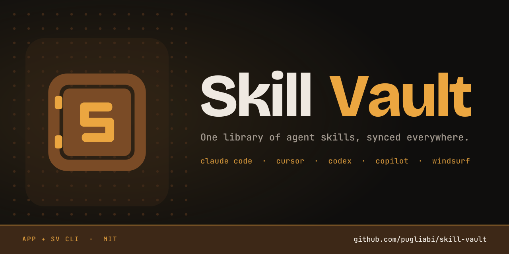

# Skill Vault brand

The Skill Vault mark is a safe: a saddle-brown body, a door seam, two amber hinges, and an amber **S** on the door. It says what the product is, a vault for your skills, and the S ties it to the name.

## Colours

| Role | Name | HEX | RGB | Use |
|---|---|---|---|---|
| Primary | Amber | `#EBA640` | 235 166 64 | The S, hinges, "Vault" in the wordmark, accents, highlights |
| Primary | Saddle brown | `#7A4B26` | 122 75 38 | The safe body, solid brand fills |
| Ground | Vault black | `#0F0E0D` | 15 14 13 | Dark backgrounds, app-icon tile, banner |
| Support | Panel | `#191715` | 25 23 21 | Cards and surfaces on dark |
| Support | Deep brown | `#3D2817` | 61 40 23 | Bands, rivets, quiet details on dark |
| Text | Cream | `#EFE9E1` | 239 233 225 | "Skill" in the wordmark, text on dark |
| Text | Muted | `#A39A90` | 163 154 144 | Secondary text on dark |

Amber on white fails text contrast, so on light backgrounds use amber only for shapes (the mark, icons, bars), never for body text. On dark backgrounds amber text is fine.

## Type

- **Wordmark and display:** Bricolage Grotesque ExtraBold. In the wordmark, "Skill" is cream and "Vault" is amber.
- **Labels, code, CLI:** JetBrains Mono.
- The app UI itself keeps Inter for body text.

## Logo files

All in `app/assets/`:

| File | Use |
|---|---|
| `skill-vault-icon.svg` | Master mark, full detail, 48 px and up |
| `skill-vault-mark-small.svg` | Small-size cut (bigger S, wider seam), 32 px and below |
| `skill-vault-mark-black.svg` | One colour, light backgrounds, print |
| `skill-vault-mark-white.svg` | One colour, dark backgrounds |
| `skill-vault-app-icon.svg` | Mark on a vault-black rounded tile |
| `skill-vault.ico` | Windows shortcut icon (16 to 256 px; small cut at 32 px and below) |
| `skill-vault-256.png` | 256 px raster of the mark |

Web icons live in `app/client/public/` (favicon.ico, favicon.svg, apple-touch-icon, 192/512 and maskable PNGs, site.webmanifest). The banner is `docs/images/skill-vault-banner.png` (1280 × 640, also usable as the GitHub social preview) with its SVG source alongside.

## Usage

- **Clear space:** keep at least the width of one hinge (about 1/16 of the mark) clear on every side.
- **Minimum size:** 16 px on screen, using the small cut below 32 px.
- **Backgrounds:** the colour mark works on vault black, panel, cream and white. On photos or busy backgrounds, put it on the app-icon tile.
- **Don't:** recolour the S or body outside the palette, add gradients or shadows, stretch it, put the legs back on, or set the wordmark in another typeface.
