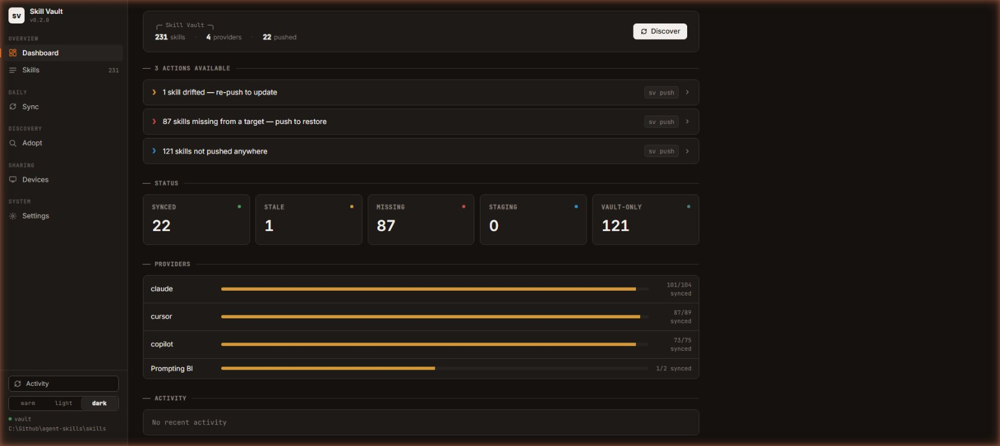
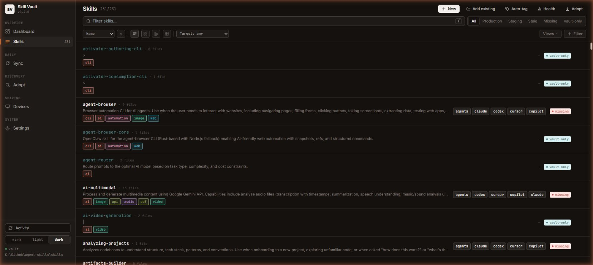
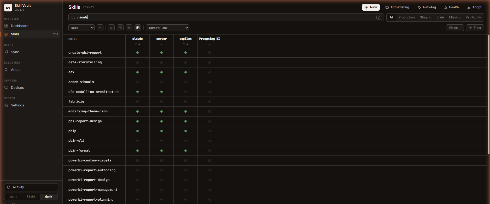
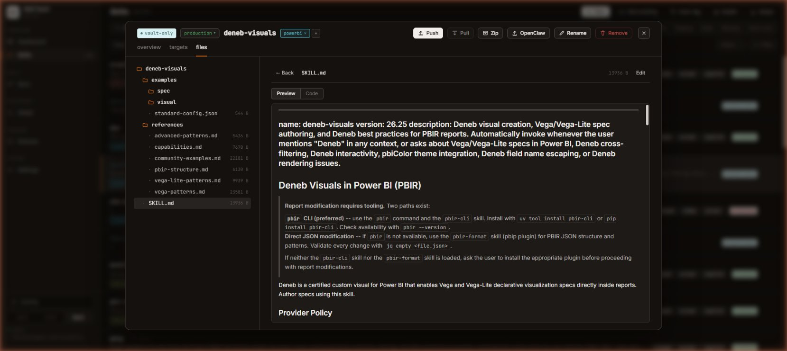
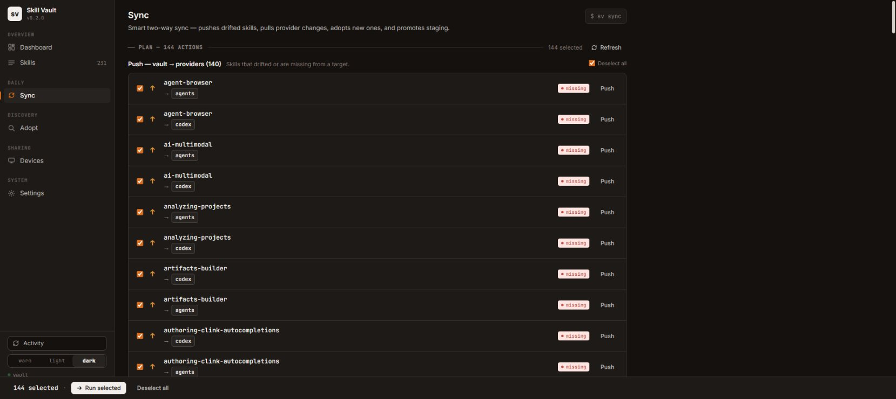
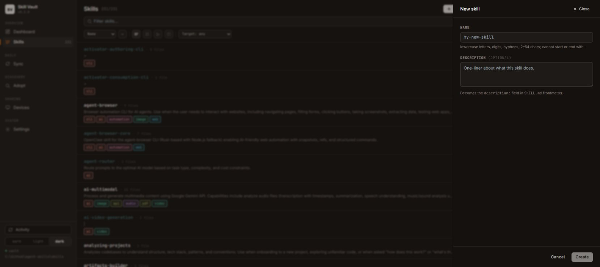
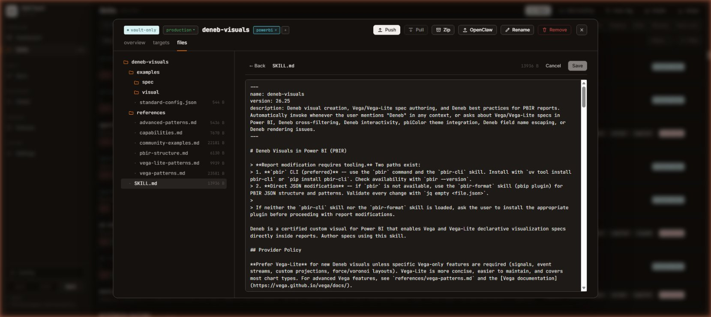
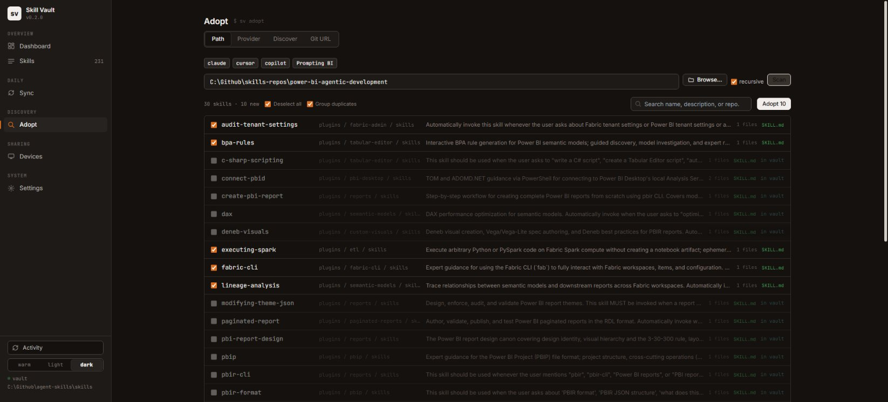
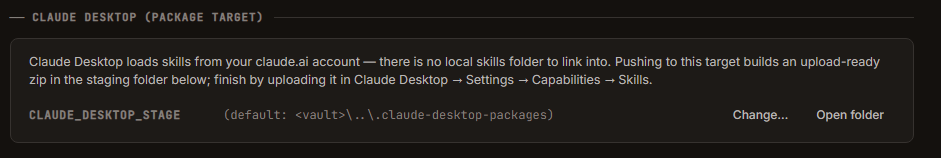
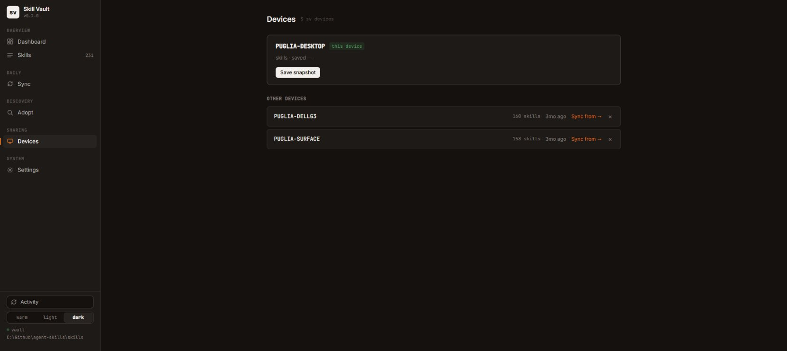

# Features & Use Cases

Skill Vault is two tools over one vault: the `sv` CLI for terminal workflows and automation, and the Skill Vault App for visual management. This page covers both, grouped by what you're trying to do.

## Dashboard — see the state of everything



The app's Dashboard summarizes the vault: skill and provider counts, status cards (synced / stale / missing / staging / vault-only), per-provider health bars, and an **actions available** list — each row is a one-click fix ("1 skill drifted — re-push to update", "87 skills missing from a target — push to restore") with the equivalent CLI command shown alongside.

CLI equivalent: `sv status` for the same numbers, `sv fix` to audit and repair vault state (broken symlinks, manifest drift, orphaned entries).

## Skills browser — find, inspect, and act on skills



The Skills page lists every skill with its description, tags, file count, configured providers, and sync state. It offers:

- **Four layouts** — list, cards, grouped, and coverage matrix.
- **Search** — matches names, descriptions, and the full SKILL.md body.
- **Status pills** — filter to Production / Staging / Stale / Missing / Vault-only.
- **Target filter** — combine a provider with a state, e.g. "everything missing from Cursor".
- **Multi-select** with a bulk action bar for pushing, tagging, or removing many skills at once.
- **Command palette** (Ctrl/⌘-K) — jump to any skill or run a command from anywhere.

CLI equivalents: `sv list`, `sv status`.

## Coverage matrix — the "what's not synced where" view



The matrix layout is a skills × providers grid. A filled dot means synced; an empty circle means not present. Click a column header to push everything missing or stale to that provider, or a single cell to push one skill to one provider. Combined with search, it answers "which of my Power BI skills are on which agent?" in one glance.

## Skill detail — inspect and edit in place



Clicking a skill opens the detail overlay with three tabs: **overview** (stage, source, path, tags, metadata), **targets** (per-provider sync state with push/pull per row), and **files** (the skill's file tree with a rendered SKILL.md preview and an in-place editor). Actions along the top: Push, Pull, Zip, export to OpenClaw, Rename (cascades everywhere), and Remove.

## Sync — two-way, with a plan you approve first



`sv sync` (CLI) and the Sync page (app) compute a smart two-way plan: **push** skills that drifted or are missing at a target, **pull** changes made in a provider directory back into the vault, **adopt** new skills found in provider directories, and **promote** staged skills. Nothing runs until you approve; in the app every row offers a **diff-before-run** so you can see exactly what changes. Deselect anything you don't want, then run the rest.

Related CLI: `sv push`, `sv import` (pull one skill from an agent dir), `sv watch` (auto-push on file change).

## Creating skills



**+ New** on the Skills page creates a skill from a name and optional description (which becomes the `description:` frontmatter). Then edit its SKILL.md right in the detail view:



With symlink pushes, saving the editor updates every agent that has the skill instantly.

## Discovery and adoption — grow the vault



The app's **Adopt** page scans four kinds of sources — a local path, a single provider, all providers (Discover), or a git URL — lists every SKILL.md found with duplicate/in-vault flags, and imports the ones you tick. The same flows in the CLI:

- `sv discover` scans registered agent directories (optionally including Claude plugins) for skills that aren't in the vault.
- `sv adopt` interactively imports discovered skills.
- `sv adopt-remote <git-url>` clones a repo or plugin URL, discovers its skills, and lets you pick which to import.
- `sv scan <path>` analyzes a local repo for skills, hooks, and commands; with the AI scanner configured it can use Claude to identify skill-like content (see [Configuration](./configuration.md#ai_scanner)).

**Add existing** on the Skills page imports a single skill folder from disk (CLI: `sv add <path>`).

## Curation — keep the library healthy

- **Auto-tagging** — heuristic tagger proposes tags per skill; review and apply in bulk.
- **Health board** — flags *trigger collisions* (skills whose descriptions are so similar an agent may pick the wrong one) and low-quality SKILL.md files (structure/quality score).
- **Staging → production** — keep experimental skills in `staging/`; `sv promote` moves them to production, `sv demote` moves them back. Status pills and the manifest track the stage.

## Packaging and sharing



Claude Desktop loads skills from your claude.ai account rather than a local folder, so Skill Vault treats it as a **package target**: pushing to it builds an upload-ready zip in a staging folder, and you finish in Claude Desktop → Settings → Capabilities → Skills. Other packaging/sharing paths:

- `sv package <skill> --target <format>` builds a target-specific artifact for tools that can't consume a plain skills directory — e.g. a Claude Desktop upload-ready zip (the app's Claude Desktop packaging does the same, staging zips in a folder you pick).
- `sv share <skill>` cross-publishes a skill to additional providers.
- **Export to OpenClaw** — installs a skill into the isolated OpenClaw WSL gateway via its own CLI.
- The Zip action on any skill produces a portable archive.

## Multi-device sync



The **Devices** page shows one snapshot card per machine — **Save snapshot** records the current machine's state, and **Sync from →** on any other device compares its snapshot with local state so you can pick what to bring over. Keep the vault directory in a git repo, then:

```bash
sv snapshot          # record this machine's state to snapshots/<machine-id>.json
sv devices           # list device snapshots
sv sync-from LAPTOP  # compare another device's snapshot and pick what to sync
```

The app's **Devices** page shows the same snapshots with a visual compare. See [vault-format.md](./vault-format.md) for the snapshot schema.

## Providers — manage where skills go

Providers are named directories skills can be pushed to — one per agent tool, plus any custom location (a project repo's skills folder, for example). Manage them in the app's Settings page (add/rename/remove with live path validation, "★ All providers" bulk add) or via `sv config`. Both tools read the same `agent_locations` map, so changes made in either are visible to both.

## AI assistant — chat agents that fix the vault

A docked chat pane on every page (sidebar button or Ctrl/⌘ + J), powered by the local Claude Code CLI. One comprehensive **vault-assistant** agent leads every chat, loading ten bundled skills on demand (vault operations, format semantics, GitHub sync, origin hunting, Notion, error triage, suggestion analysis, app navigation, skill authoring, and GitHub skill discovery — ask it to "find top-starred skills for X" and it returns a verified, star-ranked list with one-step adoption) and delegating heavy research or parallel bulk repairs to five thin specialist subagents (repo-hunter, update-fixer, skill-scout, error-triager, notion-doctor). Replies stream live over a compact tool timeline; every mutation goes through the app's own API, so it lands in Activity and version history like your own clicks, and destructive operations are excluded from its toolset entirely. A mic button dictates into the composer (Chrome/Edge). Full guide: [assistant.md](./assistant.md).

## Proactive suggestions — the app tells you what needs attention

The assistant's **For you** list ranks suggestion cards computed from the app's own signals at zero AI cost: broken update sources, available updates, failed operations, Notion conflicts and drift, stale/missing provider copies, integrity issues, name mismatches, and more. A background sweep re-checks every skill's source every 6 hours (and on demand) so the cards stay fresh. Each card deep-links to the right page and offers **Fix with AI**; dismissals persist until the card's content changes. The sidebar Assistant button carries a count of items that need action, and a one-click **AI briefing** turns the list into a prioritized plan.
